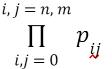

<h1>Conditional Probability Manifold Regressor v2</h1>
<h2>Purpose</h2>

Represents the class probability distribution of a dataset using KNN on classes' conditional probabilities for locations in the feature space.

Meant to generalize nonlinear relationships better than normal DT's or Gaussian NB alone.

 
 

<h2>Definitions</h2>

<strong>Let:</strong>

<ul>
    <li>The training datapoint count be represented with <strong>n</strong></li>
    <li>The feature count be represented with <strong>m</strong></li>
    <li>The class count be represented with <strong>l</strong></li>
    <li>The training dataset be denoted <strong>A = {a0, a1, a2, … ai, …, an-1}</strong></li>
    <li>The dimensions of the feature space in which all <strong>a</strong> in <strong>A</strong> reside be denoted as <strong>D = {f0, f1, f2, … fj, …, fm-1}</strong></li>
    <li>The classes be denoted with <strong>C = {c0, c1, c2, … ck, …, cl-1}</strong></li>
    <li>A testing data point be denoted <strong>x</strong></li>
    <li>Assume <strong>n_neighbors = n-1</strong></li>
</ul>

 

 

<h2>Steps:</h2>

<h3>Fitting:</h3>
<ul>
    <li>Calculate local conditional probability values for each <strong>ai</strong> in <strong>A</strong> (so you don’t have to do it again later) by finding <strong>P(class | value of ai feature1 ∧ value of ai feature2 ∧ …)</strong> using Bayes’ Theorem.</li>
    <li>AKA: Get the probability of <strong>ai</strong>’s value in <strong>fj</strong>, denoted <strong>pij</strong></li>
    <li>Find </li>
    <li>Multiply by <strong>P(class)</strong></li>
    <li>Repeat this process for all classes</li>
    <li>Basically apply Bayes’ Theorem to all the training data points for each class</li>
</ul>

<h3>Estimation:</h3>
<ul>
    <li>Apply KNN on the test point using the conditional probabilities found in training.</li>
</ul>

 

 

<h2>Features to Implement</h2>
<h3>Implement hyperparameters:</h3>
<ul>
    <li><strong>branching_depth:</strong>
        <ul>
            <li>Define how many times to recursively expand bins on neighboring points.</li>
        </ul>
    </li>
    <li><strong>n_neighbors:</strong>
        <ul>
            <li>Set the number of neighboring points to include for bin expansion at each step.</li>
            <li>Ensure a standard "resolution" of the algorithm in each dimension.</li>
            <li>If there are fewer than n_neighbors available to a point (which can only be the case if n_neighbors is greater than the sample), throw an error.</li>
        </ul>
    </li>
    <li><strong>training_fidelity:</strong>
        <ul>
            <li>Define the maximum number of neighbors or bin expansions for training data points.</li>
            <li>Ensure it's only applied if branching_depth > 0 and n_neighbors > 0.</li>
        </ul>
    </li>
    <li><strong>test_fidelity:</strong>
        <ul>
            <li>Define the maximum number of neighbors or bin expansions for testing data points.</li>
        </ul>
    </li>
</ul>

<h3>Binning of training data:</h3>
<ul>
    <li> <h4>Binning Process:</h4>
        <ul>
            <li>Define the binning process for creating discretized bins of increasing sizes around a point.</li>
            <li>Get the mean class probabilities for each bin.</li>
            <li>
                <strong>Increment bin width in all features/dimensions simultaneously:</strong>
                <ul>
                    <li>Identify the overall nearest neighbor in each dimension using Euclidean distance.</li>
                    <li>Increment bin width in all dimensions based on the distance to this nearest neighbor.</li>
                    <li>Repeat this for multiple bin expansions.</li>
                </ul>
            </li>
        </ul>
    </li>
    <li> <h4>Variance Collection:</h4>
        <ul>
            <li>Calculate the variance matrix for each bin based on points within the bin.</li>
            <li>Calculate t or z values based on the sample size of points in the bin.</li>
            <li>Apply inverse weighting based on these variance matrices and t/z values.</li>
            <li>Weigh incrementally larger discretized bins inversely proportional to their individual variance matrices and t or z values</li>
        </ul>
    </li>
    <li> <h4>Bins as inputs to a Kalman filter:</h4>
        <ul>
            <li>Implement Kalman filtering to process input from different sized bins.</li>
            <li>Ensure compatibility between varying bin sizes and the Kalman filter input.</li>
            <li>Note that as the bin width increases, the precision decreases but the accuracy increases.</li>
        </ul>
    </li>
</ul>

<h3>Binning of test data:</h3>
<ul>
    <li>Replace KNN with the binning method above, but for test data points as well.</li>
    <li>Implement binning around the test point itself, using the modified conditional probabilities found for the training points.</li>
</ul>

 

 

<h2>Pseudocode:</h2>

<pre style="background-color: #f4f4f4; padding: 10px; border-radius: 5px; white-space: pre-wrap; word-wrap: break-word;">
             
        For each datapoint in the training dataset, <strong>ai</strong>:
            Let <strong>ClassBinCondProbs</strong> be a matrix of dimensions <strong>l x nneighbors</strong>. 
            For each <strong>z</strong> in range(0, <strong>nneighbors</strong>):
                Compose a set of points, denoted <strong>BinContents</strong>, containing <strong>ai</strong> as well as its <strong>z</strong> nearest neighbors using a KD tree. 
                Create a discrete ‘bin’, denoted as <strong>BinProperties</strong>, with the following properties: <strong>binWidths</strong> is an array of length <strong>m</strong>, <strong>binCenters</strong> is an array of length <strong>m</strong>, <strong>binMeans</strong> is an array of length <strong>m</strong>, and <strong>binCovarianceMatrix</strong> is a matrix of dimensions <strong>m x m</strong>.
                 
                Let the pair of points in <strong>BinContents</strong> that has the largest difference in dimension <strong>fj</strong> be referred to as <strong>aij-min</strong> and <strong>aij-max</strong>. 
                For each <strong>fj</strong> in <strong>D</strong>:
                    Let <strong>BinProperties.binWidths[fj]</strong> be determined by the difference between <strong>aij-min</strong> and <strong>aij-max</strong>’s values in <strong>fj</strong>. 
                    Let <strong>BinProperties.binCenters[fj]</strong> be determined with the average of <strong>aij-min</strong> and <strong>aij-max</strong>’s values in <strong>fj</strong>. 
                    Let <strong>BinProperties.binMeans[fj]</strong> be the mean of all points in <strong>BinContents</strong> in <strong>fj</strong>. 
                    Let <strong>BinProperties.binCovarianceMatrix</strong> be the covariance matrix for all points in <strong>BinContents</strong>, calculated using degrees of freedom correction.
                 
                For each class, <strong>ck</strong>, in <strong>C</strong>:
                    Let <strong>ClassBinCondProbs[ck][z]</strong> be the conditional probability for class <strong>ck</strong>. 
                    Calculate this using Bayes’ theorem, by multiplying the conditional probabilities that a random value falls within <strong>BinProperties.binWidths[fj]/2</strong> units of <strong>BinProperties.binCenters[fj]</strong> for all <strong>fj</strong> in <strong>D</strong> and then dividing by the estimates of the priors.
                 
            Use Kalman filtering to combine the covariance matrices and mean class conditional probabilities for bins of all sizes at point <strong>ai</strong>.
            This should allow us to get a better estimate of the true conditional class probabilities at <strong>ai</strong>, get a refined covariance matrix for <strong>ai</strong>, and store these summary statistics in a new variable, called <strong>aiPopulationStatEstimates</strong>.
             
            Append <strong>aiPopulationStatEstimates</strong> to a set of all the training datapoints’ statistics, at index <strong>i</strong> (like the subscript <strong>i</strong> of <strong>ai</strong>).
         
        For testing, consider an arbitrary point in the testing dataset, denoted with <strong>x</strong>: 
        Apply the same binning process described above, but using the updated training data point likelihood estimates with more of a Gaussian Naive Bayes approach, as well as variances to get better estimates of the class likelihoods and variances at the test point.
</pre>

 

 

<h2>Future Ideas</h2>
    <ul>
        <li>Use statistics to detect interaction effects between features.</li>
        <li>Model interaction effects as additional dimensions?</li>
        <li>Parametrize nonparametric manifold estimation?</li>
    </ul>
